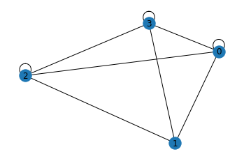
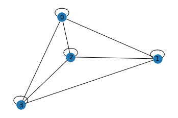
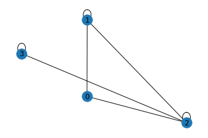
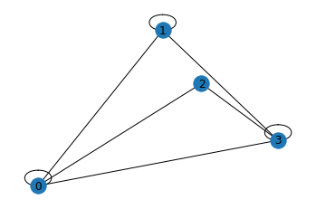
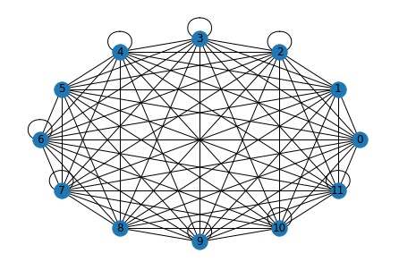

# Standard Imports
Import Graph Theory tools to commence assessment on Characteristic Path Length.
## Characteristic Path Length and Global Efficiancy
Characteristic Path Length is a distance metric that provides insight into network analysis.[1,2,3,6,7]  It is used in many fields such as World-Wide-Web, the Internet, biological, electrical, and many other  giving insights into many things. The number of connections needed to transverse from one connection to another is the measure that is given by the characteristic path length. Here is the equation for Characteristic Path Length often called average shortest path length. Futhermore it said to be the average of the all the distances over the pairs of edges.

Where $l_i$ is average path length.<p></p>
Where $V$ is the set of nodes in a graph.<p></p>
Where $q = |V|$ represents its order.

$$ \frac{1}{q(q-1)}\sum_{i\in V} l_i $$[6]

Much of this is based on the dynamics of the small networks. [3]  Much of this is done to networks that are between regularity, and disorder in a region called small world networks. [3] Some uses that comes from this for example is shown in how neural circuits in the brain are heavily impacted by the various types of lesions that can form, storkes and other damages that can occur to them. [4] Using Graph Theory one can see the impact of the importantce of the measure. In reality this measure shows how information can easily be spread from one area to another such as the  case of the Major Depressive Disorder Patients in a study that used a network/graph to treat patients. [5]<p></p>

Global Efficiancy is given in the following equation which looks very similar to the Characteristic Path Length Equation.<p></p>

Where $l_{ij}$ is average path length.<p></p>
Where $i$ and $j$ are two nodes that are in the graph.<p></p>
Where $V$ is the set of nodes in a graph.<p></p>
Where $q = |V|$ represents its order.

$$ \frac{1}{q(q-1)}\sum_{i\in V} \frac{1}{l_{ij}} $$

The global efficiancy is the average of the inverse shortest path length for all pairs of nodes.[1,2,3,6,7]  The main focus of this network is the how it shows how two nodes commicate thus being a valuable connection between characteristic path length giving insight to how information speards across a network.

### Work Cited
1. Strang, A., Haynes, O., Cahill, N.D. and Narayan, D.A., 2018. Generalized relationships between characteristic path length, efficiency, clustering coefficients, and density. Social Network Analysis and Mining, 8(1), pp.1-6.
2. Albert, R. and Barabási, A.L., 2002. Statistical mechanics of complex networks. Reviews of modern physics, 74(1), p.47.
3. Watts, D., Strogatz, S. Collective dynamics of ‘small-world’ networks. Nature 393, 440–442 (1998)
4. Jahanshad N, Prasad G, Toga AW, McMahon KL, de Zubicaray GI, Martin NG, Wright MJ, Thompson PM. Genetics of Path Lengths in Brain Connectivity Networks: HARDI-Based Maps in 457 Adults. Multimodal Brain Image Anal (2012). 2012;7509:29-40. doi: 10.1007/978-3-642-33530-3_3. PMID: 25584366; PMCID: PMC4288784.
5. Ozseven T. Optimization and Robotic Applications [Internet]. New York: Nova; 2019 [cited 2022 Feb 28]. (Robotics Research and Technology Ser). Available from: https://search.ebscohost.com/login.aspx?direct=true&AuthType=cookie,ip,url,cpid&custid=keaninf&db=nlebk&AN=2235569&site=ehost-live&scope=site
6. ENRICO., STAMILE, CLAUDIO. MARZULLO, ALDO. DEUSEBIO. Graph Machine Learning: Take Graph Data to the next Level by Applying Machine Learning... Techniques and Algorithms. PACKT PUBLISHING LIMITED, 2021.
7. Latora, V. and Marchiori, M., 2001. Efficient behavior of small-world networks. Physical review letters, 87(19), p.198701.


```python
from google.colab import drive
drive.mount('/content/drive')
```

    Mounted at /content/drive


```python
import pandas as pd
import numpy as np
import matplotlib.pyplot as plt
import networkx as nx
from IPython.display import display
```


```python
class AdjtoGraph:
    def __init__(self,nodes):
        self.nodes = nodes
    def matrix_creation(self):
        matrix = np.empty((self.nodes,self.nodes))
        for i in range(self.nodes):
            for j in range(self.nodes):
                matrix[i][j] = np.random.randint(0,self.nodes)
        G = nx.from_numpy_array(matrix)
        return G, matrix
```


```python
ASPL_ls = []
matrix_ls = []
graph_ls = []
for i in range(4):
    Graph1 = AdjtoGraph(nodes=4)
    G, matrix = Graph1.matrix_creation()
    ASPL_ls.append(nx.average_shortest_path_length(G))
    matrix_ls.append(matrix)
    graph_ls.append(G)
    print(f"Global Efficiency is {nx.global_efficiency(G)}")
```

    Global Efficiency is 1.0
    Global Efficiency is 1.0
    Global Efficiency is 0.8333333333333334
    Global Efficiency is 0.9166666666666666


```python
df_ls = list(map(lambda x: pd.DataFrame(x), matrix_ls))
i = lambda x: x
l = 0
for j in df_ls:
    print(l)
    display(i(j))
    l+=1
```

    0


<div>
<style scoped>
    .dataframe tbody tr th:only-of-type {
        vertical-align: middle;
    }

    .dataframe tbody tr th {
        vertical-align: top;
    }

    .dataframe thead th {
        text-align: right;
    }
</style>
<table border="1" class="dataframe">
  <thead>
    <tr style="text-align: right;">
      <th></th>
      <th>0</th>
      <th>1</th>
      <th>2</th>
      <th>3</th>
    </tr>
  </thead>
  <tbody>
    <tr>
      <th>0</th>
      <td>2.0</td>
      <td>3.0</td>
      <td>1.0</td>
      <td>3.0</td>
    </tr>
    <tr>
      <th>1</th>
      <td>2.0</td>
      <td>0.0</td>
      <td>3.0</td>
      <td>3.0</td>
    </tr>
    <tr>
      <th>2</th>
      <td>1.0</td>
      <td>1.0</td>
      <td>3.0</td>
      <td>0.0</td>
    </tr>
    <tr>
      <th>3</th>
      <td>3.0</td>
      <td>3.0</td>
      <td>2.0</td>
      <td>3.0</td>
    </tr>
  </tbody>
</table>
</div>


    1


<div>
<style scoped>
    .dataframe tbody tr th:only-of-type {
        vertical-align: middle;
    }

    .dataframe tbody tr th {
        vertical-align: top;
    }

    .dataframe thead th {
        text-align: right;
    }
</style>
<table border="1" class="dataframe">
  <thead>
    <tr style="text-align: right;">
      <th></th>
      <th>0</th>
      <th>1</th>
      <th>2</th>
      <th>3</th>
    </tr>
  </thead>
  <tbody>
    <tr>
      <th>0</th>
      <td>3.0</td>
      <td>3.0</td>
      <td>3.0</td>
      <td>1.0</td>
    </tr>
    <tr>
      <th>1</th>
      <td>2.0</td>
      <td>3.0</td>
      <td>3.0</td>
      <td>2.0</td>
    </tr>
    <tr>
      <th>2</th>
      <td>1.0</td>
      <td>0.0</td>
      <td>2.0</td>
      <td>3.0</td>
    </tr>
    <tr>
      <th>3</th>
      <td>2.0</td>
      <td>0.0</td>
      <td>0.0</td>
      <td>2.0</td>
    </tr>
  </tbody>
</table>
</div>


    2


<div>
<style scoped>
    .dataframe tbody tr th:only-of-type {
        vertical-align: middle;
    }

    .dataframe tbody tr th {
        vertical-align: top;
    }

    .dataframe thead th {
        text-align: right;
    }
</style>
<table border="1" class="dataframe">
  <thead>
    <tr style="text-align: right;">
      <th></th>
      <th>0</th>
      <th>1</th>
      <th>2</th>
      <th>3</th>
    </tr>
  </thead>
  <tbody>
    <tr>
      <th>0</th>
      <td>0.0</td>
      <td>0.0</td>
      <td>2.0</td>
      <td>0.0</td>
    </tr>
    <tr>
      <th>1</th>
      <td>2.0</td>
      <td>2.0</td>
      <td>3.0</td>
      <td>0.0</td>
    </tr>
    <tr>
      <th>2</th>
      <td>1.0</td>
      <td>2.0</td>
      <td>3.0</td>
      <td>1.0</td>
    </tr>
    <tr>
      <th>3</th>
      <td>0.0</td>
      <td>0.0</td>
      <td>3.0</td>
      <td>1.0</td>
    </tr>
  </tbody>
</table>
</div>


    3


<div>
<style scoped>
    .dataframe tbody tr th:only-of-type {
        vertical-align: middle;
    }

    .dataframe tbody tr th {
        vertical-align: top;
    }

    .dataframe thead th {
        text-align: right;
    }
</style>
<table border="1" class="dataframe">
  <thead>
    <tr style="text-align: right;">
      <th></th>
      <th>0</th>
      <th>1</th>
      <th>2</th>
      <th>3</th>
    </tr>
  </thead>
  <tbody>
    <tr>
      <th>0</th>
      <td>2.0</td>
      <td>2.0</td>
      <td>0.0</td>
      <td>3.0</td>
    </tr>
    <tr>
      <th>1</th>
      <td>1.0</td>
      <td>3.0</td>
      <td>0.0</td>
      <td>3.0</td>
    </tr>
    <tr>
      <th>2</th>
      <td>2.0</td>
      <td>0.0</td>
      <td>0.0</td>
      <td>3.0</td>
    </tr>
    <tr>
      <th>3</th>
      <td>0.0</td>
      <td>2.0</td>
      <td>2.0</td>
      <td>1.0</td>
    </tr>
  </tbody>
</table>
</div>


```python
y = lambda a: nx.draw_random(a, with_labels = True)
for x in graph_ls:
    fig, ax = plt.subplots()
    ax = y(x)
```














```python
nx.draw_circular(G, with_labels = True)
```





```python
!jupyter nbconvert "/content/drive/MyDrive/Colab Notebooks/SunSpots.ipynb" --to markdown  --output-dir markdown
```
